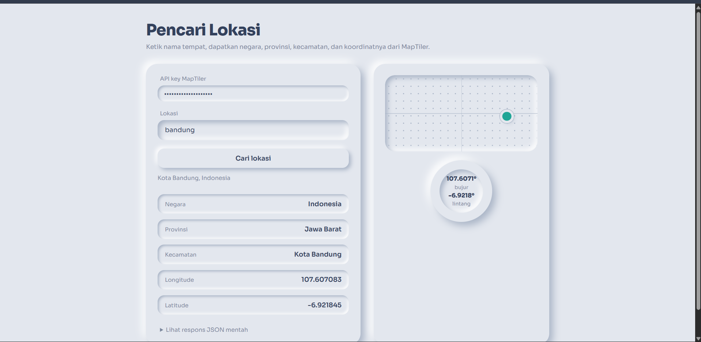
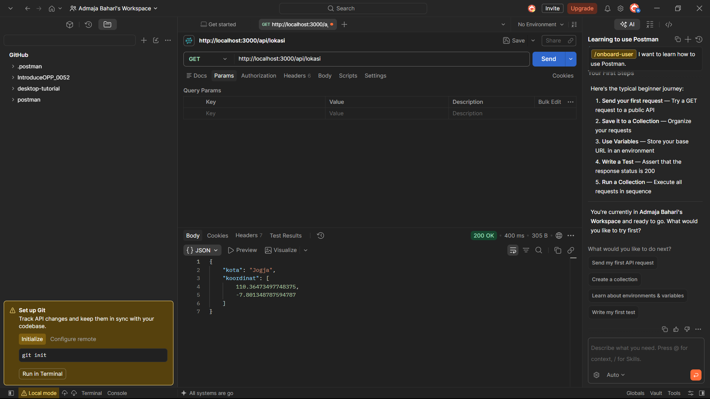

# 052_WeatherApi

Antarmuka HTML bergaya **neumorphism** untuk mengambil data lokasi dari API [MapTiler Geocoding](https://docs.maptiler.com/cloud/api/geocoding/).

## Data yang ditampilkan

| Kolom     | Sumber di respons API                          |
|-----------|-------------------------------------------------|
| Lokasi    | Input dari pengguna                             |
| Negara    | `context` bertipe `country`                     |
| Provinsi  | `context` bertipe `region`                      |
| Kecamatan | `context` bertipe `municipal_district` / `county` / `locality` |
| Longitude | `center[0]`                                     |
| Latitude  | `center[1]`                                     |

## Cara menjalankan

1. Daftar di [maptiler.com](https://cloud.maptiler.com/) dan salin API key.
2. Buka `index.html` di browser.
3. Tempel API key (disimpan di localStorage browser, tidak ikut ter-commit), ketik lokasi, lalu klik **Cari lokasi**.

## Endpoint

```
GET https://api.maptiler.com/geocoding/{lokasi}.json?key=API_KEY&language=id&limit=1
```

## Screenshot hasil GET

### Tampilan di browser


### Respons di Postman
